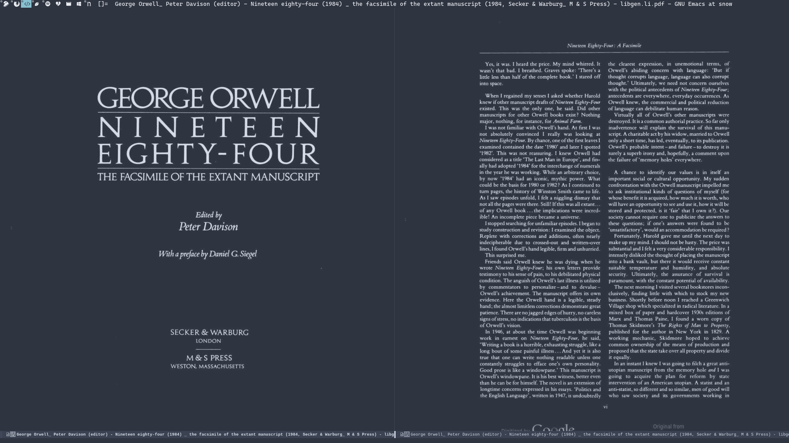
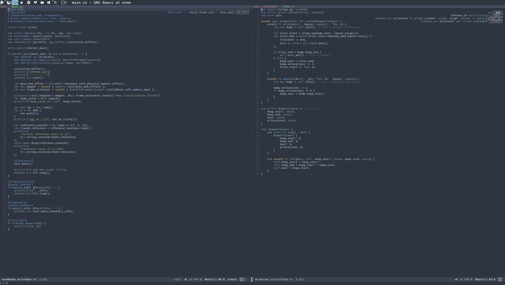
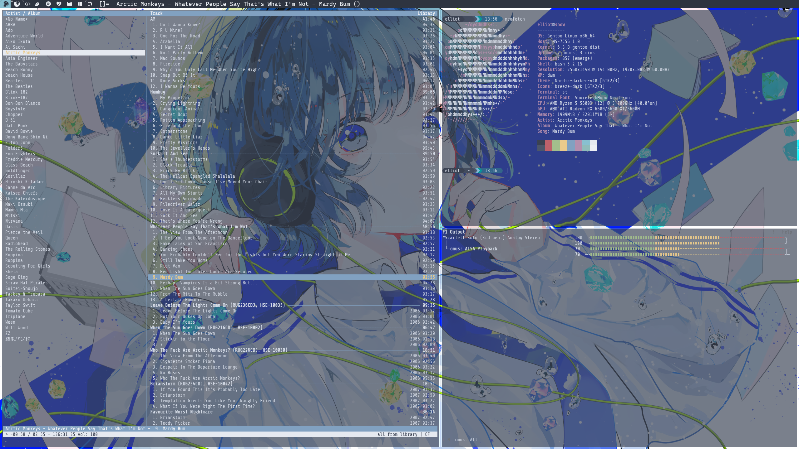

+++
title = "dotfiles"
date = 2022-08-12
[extra]
math = false
[taxonomies]
categories = ["misc"]
tags = ["gentoo","linux"]
+++

We all have a dream inside us of living indefinitely in the tty, but we live in Orwell's society of Xorg and 
Wayland display servers. I personally suffer in this society in dwm and Xorg. My build of dwm and 
st can be found on my [GitHub](https://github.com/elliowo/dotfiles), additionally my Emacs and Gentoo configurations.







___Packages___
- window manager - [dwm](https://dwm.suckless.org/)
- status bar - shell script
- terminal - [st](https://st.suckless.org/)
- shell - bash
- launcher - [dmenu](https://tools.suckless.org/dmenu/)
- file manager - [ranger](https://ranger.github.io/)
- music player - [cmus](https://cmus.github.io/)
- media player - [mpv](https://tools.suckless.org/slock/)
- lockscreen - [slock](https://tools.suckless.org/slock/)
- web browser - [firefox arkenfox user.js](https://github.com/arkenfox/user.js)
- text editor/pdf viewer - [emacs](https://www.gnu.org/software/emacs/)

shell script I use for my bar on my laptop(T480 double battery), requires [nerdfonts](https://www.nerdfonts.com/) to view icons.
```sh
while true; do

    LOCALTIME=$(date +[%Y-%m-%d][%H:%M])
    VOL=$(amixer get Master | tail -1 | sed 's/.*\[\([0-9]*%\)\].*/\1/')
    MEM=$(free -h --kilo | awk '/^Mem:/ {print $3 "/" $2}')
    CPU=$(top -bn 1 | grep "Cpu(s)" | tr -d 'usy,' | awk '{print $3}' )
    TEMP="$(($(cat /sys/class/thermal/thermal_zone0/temp) / 1000))󰔄"
    DISK=$(df -Ph | grep "/dev/nvme0n1p3" | awk {'print $3'})
    DISKLEFT=$(df -Ph | grep "/dev/nvme0n1p3" | awk {'print $2'})
    BAT0="$(cat /sys/class/power_supply/BAT0/capacity)"
    BAT1="$(cat /sys/class/power_supply/BAT1/capacity)"
    
    
    xsetroot -name " [󰄩: $MEM][󰍛:$CPU% $TEMP][󰋊: $DISK/$DISKLEFT][: $VOL][$BAT0%|$BAT1%  ]$LOCALTIME"
    sleep 10s
done &
```

saying i want to live in tty whilst using emacs wwwwwwwwwww  
lisp and emacs is just based, pure tty is bliss  
society is made for w3m and nano
