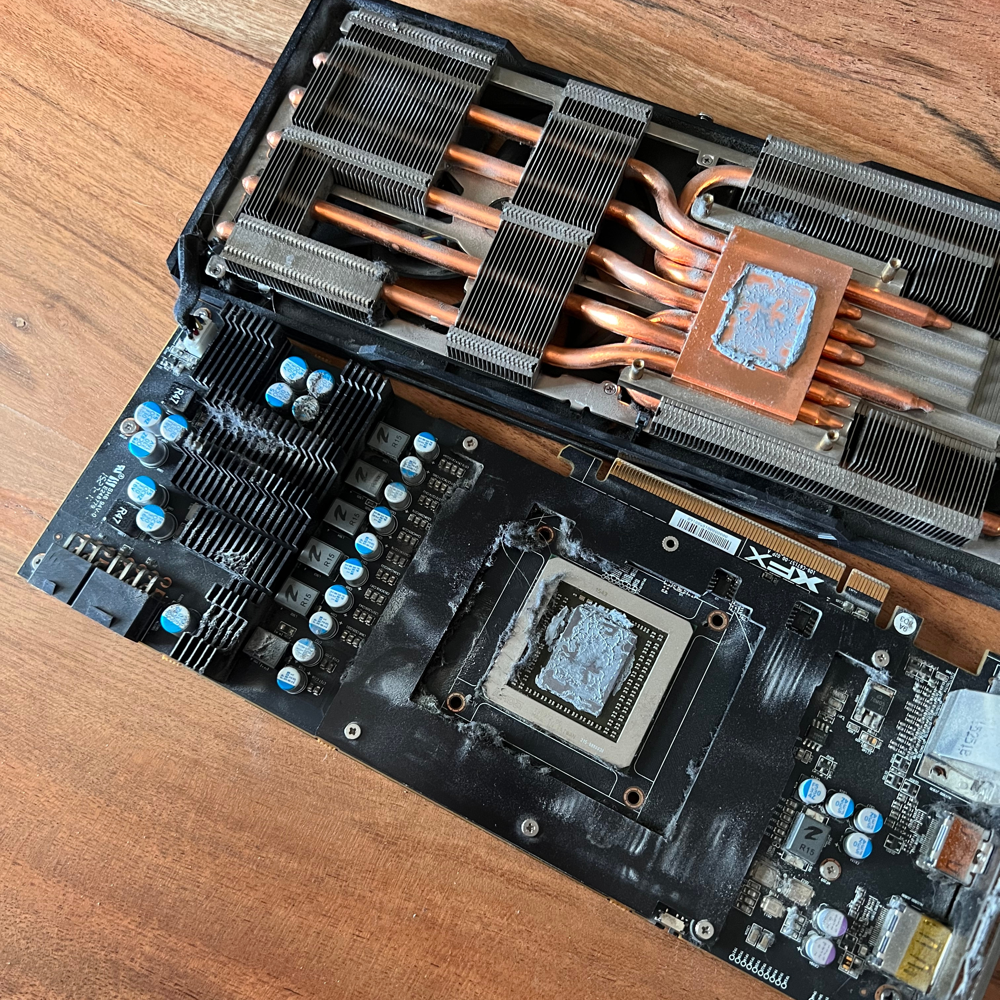
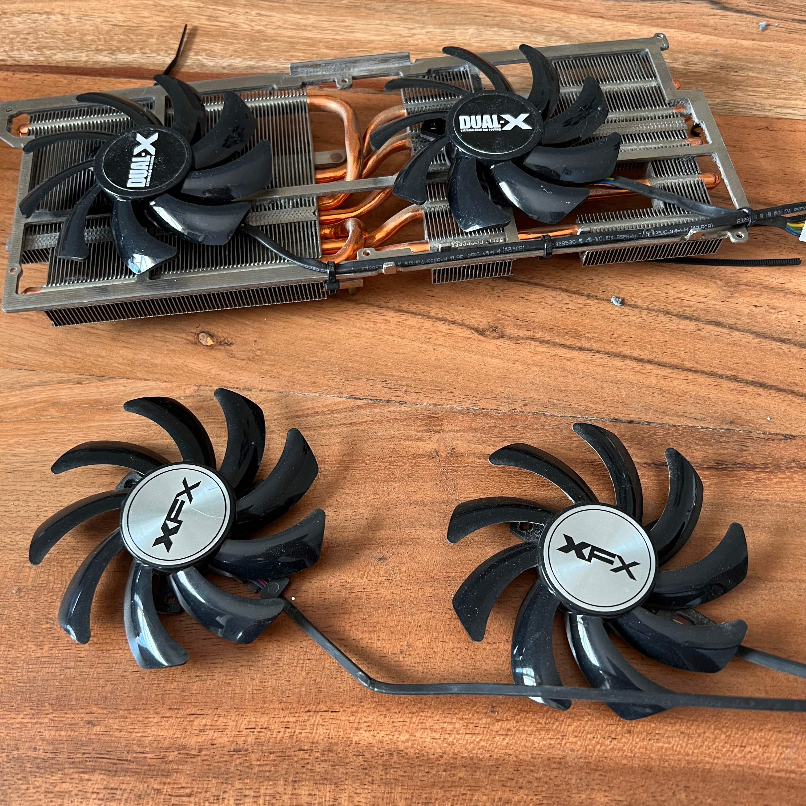
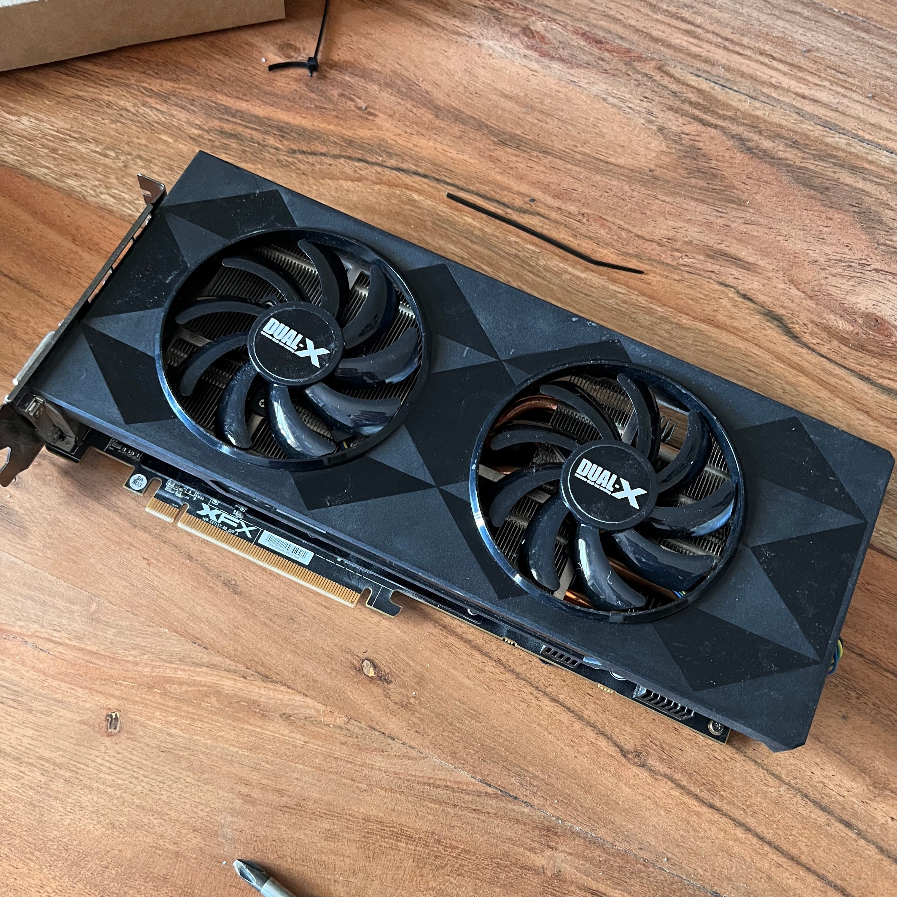

+++
title = "GPU fan replacement"
date = 2022-04-25
[taxonomies]
categories = ["hardware"]
tags = ["repair"]
+++

# GPU Fan Replacement
## Preface
The Radeon R9 390 maybe an outdated card but still manages to keep up with my needs. My needs
are limited so I don't want to fork out £500+ on a new card. I realised that the fans would only start
when at 70°C and only one of the fans was operational. I first thought it was a driver issue,
unfortunately was not. The fan would operate when set to 5000+ rpm but would only work on one fan as before, and 
said the output was 3000 rpm. I also discovered it is a common issue with the xfx model, 
so ordered a replacement fan. I got these from aliexpress because cheap and couldn't be bothered
going to xfx, which they will give you.

## Installation of fan
You start off with voiding the waranty since the unfortunate part of this is that once you
open the card you void the warranty. Since my card had already gone past it's warranty I 
did not mind doing this. 

Whilst I had the card open I decided to get a good clean of it and replaced the thermal 
paste. This will probably make a couple degrees different but nothing majorly. I cannot
measure this since I could not get a clear measurement before because the issues with 
the fans

After being stripped and cleaned I screwed the fans back into place and cable tied them
to the heatsink. This took three times because I somehow managed to put it upside down
three times but once I eventually got it right I plugged the new fan into the fan controller
and then put the screws back into place.

### Summary

By replacing the fans I saved a significant amount of money and now have quieter card. The 
temperatures idle around 34°C's compared to the 40-50 before hand, this also saves a couple watts 
of electricity. Not long after I managed to get hold of an RX 6660 XT for cheap off a friend. The R9
390 is now in a another machine and has stopped 2 graphics cards getting scrapped.
