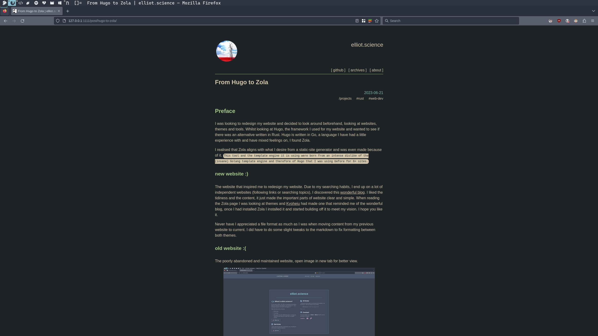
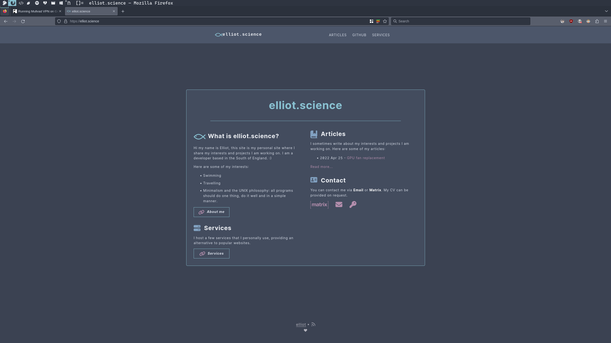

+++
title = "From Hugo to Zola"
date = 2023-06-21
[extra]
math = true
[taxonomies]
categories = ["projects"]
tags = ["rust", "web-dev"]
+++

### Preface

I was looking to redesign my website and decided to look around beforehand, looking at websites, 
themes and tools. Whilst looking at Hugo, the framework I used for my website and wanted to see if
there was an alternative written in Rust. Hugo is written in Go, a language I have had a little 
experience with and have mixed feelings on, I found Zola.

I realised that Zola aligns with what I desire from a static-site generator and was even made because
of it. `This tool and the template engine it is using were born from an intense dislike of the 
(insane) Golang template engine and therefore of Hugo that I was using before for 6+ sites.`

#### new website :)

The website that inspired me to redesign my website. Due to my searching habits, I end up on a lot of
independent websites (following links or searching topics), I discovered this [wonderful blog](https://eli.thegreenplace.net/). I liked the
tidiness and the content, it just made the important parts of website clear and simple. When reading
the Zola page I was looking at themes and [Kyoheiu](https://github.com/kyoheiu/emily_zola_theme) had made one that reminded me of the wonderful 
blog, once I had installed Zola I installed it and started building off it to meet my vision. I hope you like 
it.

Never have I appreciated a file format as much as I was when moving content from my previous website to 
current. I did have to do some slight tweaks to the markdown to fix formatting between both themes.

The new website has come with some features that the old one lacked. Main features are RSS, MathJax and
syntax highlighting!

Euler's identity:
##### $e^{i\pi }+1=0$

"Hello World!" example in C:
```c
#include <stdio.h>

int main(int argc, char** argv){
  puts("Hello, world!");
  return 0;
}
```

The unfortunate part of the new design is it doesn't match the rest of my system, using the nord 
theme, it instead uses the everforest theme.



#### old website :(
The poorly abandoned and maintained website, open image in new tab for better view. 


