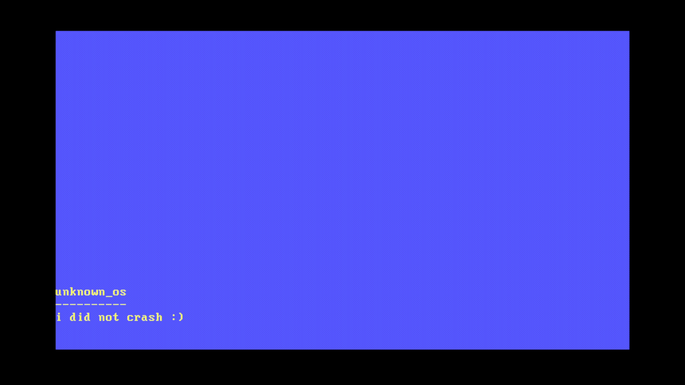

+++
title = "Writing an operating system in Rust"
date = 2023-02-12
[extra]
math = false
[taxonomies]
categories = ["projects"]
tags = ["rust", "gentoo", "operating systems"]
+++

### Preface
Somewhere in-between self-hatred and boredom I came up with the idea of writing an 
operating system. I don't know if it came from interest or ego, but I decided to go through with it. With
operating systems there are a few languages that are applicable to this, mainly Assembly, C, C++ 
and Rust due to speed and memory management.

I have never written a kernel module, let alone start a kernel from scratch. So I chose the sane choice 
of the language with the least resources. Project will require a ton of reading anyway, will just add to
suffering.

__Features__
- BIOS
- VGA text mode
- CPU exceptions
- double faults
- hardware interrupts
- paging
- heap allocation
- keyboard support using PS/2
- testing

#### What I've learnt
During this project I have discovered a lot about computers that I did not understand. This was mostly
gaps in knowledge that have been filled in through learning the underlying technology or things I had 
a rough understanding from school computer architecture lessons. 

One thing that has blown my mind is discovering that computers aren't 64 bit. When I discovered this 
I wasn't surprised, but had never thought about it. 64 bit only supports 48 bit addresses.

I have not discovered whether it was out of self-hatred or ego, but self-hatred did come from the 
project and damage to the ego. It did bounce back twice as much, unfortunately.

##### A lesson in drunk programming
This was a bit of a drunk project for me I done most of the programming and research after coming back 
from the pub. This had comeback in a worse form than a hangover. After a servilely heavy night 
of 10 pints of Guinness, I lost count and shots. I  woke up hanging, but later realised was the least of 
my worries. I discovered that I had implemented paging(memory management), I was defiantly over 
the drinking limit of having access to a text editor, complier and shell. I made some beautiful code I 
still do not understand to this day, I made some war-crimes of code that I spent the entire next day 
trying to fix. 

Drunk night was also the night I found out 64 bit is only 48 bit addresses :)

#### The future of the project
I called this operating system unknown_os due to me not knowing where I would take it at first, I now 
have more of an idea and future things I want to add. Also, I would not call this an operating system
in it's current state as it is just a kernel. I have thought about making it POSIX compliant, but am 
unsure because will be restrained by standards. The power of TempleOS, inspires me and think there is
true genius in it's design and development. I don't know whether it is a shame or a beauty what happened. 

__Features I would like__
- shell, allows for a lot
- filesystem, probably something like ext2 or fat
- chess
- tetris
- support for other language(maybe)
